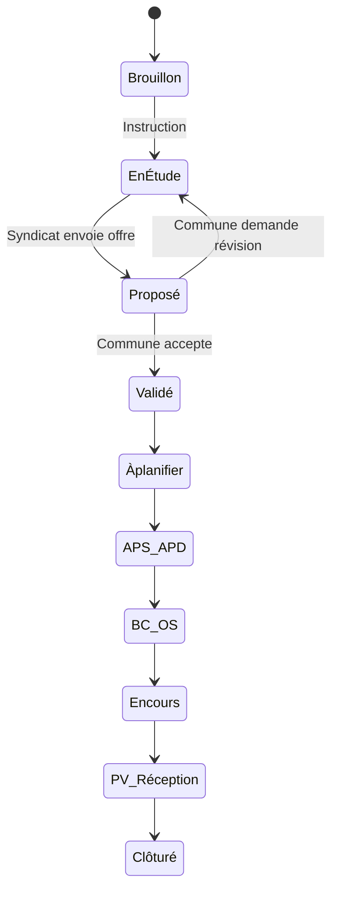

# Sinfoni — Contexte complet pour agent IA

> **Document de référence** destiné à fournir le contexte métier, technique et opérationnel de la plateforme **Sinfoni** (marque **GSI Concept**) à un agent IA (Cursor, Claude, etc.).
>
> **Langue UI** : français. **Répondre en français** lors des interactions utilisateur.
>
> Dernière mise à jour : août 2026 — branche `main`, repo `Sinfoni_V02`.

---

## Table des matières

1. [Vue d'ensemble](#1-vue-densemble)
2. [Stack technique](#2-stack-technique)
3. [Environnement de développement](#3-environnement-de-développement)
4. [Architecture applicative](#4-architecture-applicative)
5. [Sécurité multi-tenant](#5-sécurité-multi-tenant)
6. [Rôles et permissions](#6-rôles-et-permissions)
7. [Routes et navigation](#7-routes-et-navigation)
8. [Modules fonctionnels](#8-modules-fonctionnels)
9. [Modèle de données](#9-modèle-de-données)
10. [Hooks React Query](#10-hooks-react-query)
11. [Structure des fichiers](#11-structure-des-fichiers)
12. [Workflows métier](#12-workflows-métier)
13. [SIG — Import / Export](#13-sig--import--export)
14. [Constantes métier](#14-constantes-métier)
15. [Données de démo](#15-données-de-démo)
16. [Pièges connus](#16-pièges-connus)
17. [Checklist développement](#17-checklist-développement)

---

## 1. Vue d'ensemble

**Sinfoni** est une application web de gestion d'affaires énergétiques pour un **syndicat d'énergie** (GSI Concept) et un **portail commune** destiné aux élus.

### Domaines couverts

| Domaine | Description |
|---------|-------------|
| **Affaires / Projets** | Cycle de vie complet : instruction, chiffrage, exécution, clôture |
| **GED** | Gestion électronique des documents (upload, catégories, génération PDF) |
| **Cartographie SIG** | Carte Leaflet des chantiers, patrimoine IRVE/éclairage, import/export Shapefile |
| **Financier & BPU** | Catalogue prix, lignes de devis, facturation acompte/solde, PDF |
| **PPI** | Plan Pluriannuel d'Investissement (plafond 2 M€/an) |
| **Maintenance** | Tickets liés aux équipements, assignation techniciens/prestataires |
| **Planning** | Timeline des interventions, charge équipe, habilitations électriques |
| **Contacts** | Annuaire hiérarchique (organigramme) du syndicat |
| **Portail Commune** | Carte consultation, demandes travaux, suivi dossiers (lecture seule) |
| **Analytics** | CA, marge, santé portefeuille (DGS/DST) |
| **LED & CEE** | Simulateur ROI éclairage public, plan financement CEE BAR-EQ-111 |

### Utilisateurs cibles

- **Syndicat** : DGS, DST, Chargés d'affaires, Prestataires extérieurs
- **Communes adhérentes** : Élus (rôle COMMUNE), accès restreint à leur territoire INSEE

---

## 2. Stack technique

| Couche | Technologie |
|--------|-------------|
| **Frontend** | React 18, TypeScript, Vite 5 (port **4301**) |
| **Routing** | React Router 7 |
| **État serveur** | TanStack React Query v5 |
| **Styles** | Tailwind CSS 3, composants Radix UI |
| **Cartographie** | Leaflet + react-leaflet |
| **PDF** | jsPDF + jspdf-autotable |
| **SIG** | shpjs (import), @mapbox/shp-write (export) |
| **Graphiques** | Recharts |
| **Backend** | Supabase (PostgreSQL 17, PostgREST, Auth, Storage) |
| **Icônes** | lucide-react |

### Scripts npm

```bash
npm run dev        # Serveur Vite → http://localhost:4301
npm run build      # Build production
npm run typecheck  # tsc --noEmit
npm run lint       # ESLint 9
npm run preview    # Preview build (port 4301)
```

### Variables d'environnement (`.env.local`)

```env
VITE_SUPABASE_URL=http://127.0.0.1:15431
VITE_SUPABASE_ANON_KEY=<clé anon Supabase locale>
VITE_DEFAULT_ORGANIZATION_ID=00000000-0000-0000-0000-000000000001
```

---

## 3. Environnement de développement

### Supabase local (ports remappés)

Sur Windows, Hyper-V réserve souvent la plage **54279–54378**, ce qui bloque les ports Supabase par défaut. Les ports sont remappés dans `supabase/config.toml` :

| Service | Port hôte |
|---------|-----------|
| API (Kong/PostgREST) | **15431** |
| PostgreSQL | **15432** |
| Studio | **15433** |
| Inbucket (emails) | **15434** |
| Analytics | **désactivé** |

### Démarrage

```bash
# Terminal 1 — Supabase
npx supabase start --ignore-health-check

# Terminal 2 — Frontend
npm run dev
```

- **Frontend** : http://localhost:4301
- **Supabase Studio** : http://localhost:15433
- **Proxy Vite** : `vite.config.ts` proxifie `/rest` vers `15431`

### Auth en dev

- Le client Supabase (`src/lib/supabase.ts`) contourne le deadlock `navigator.locks` sur Windows.
- `RoleSwitcher` dans le header permet de basculer entre rôles sans changer de JWT.
- Ne pas committer `.env.local` (dans `.gitignore`).

---

## 4. Architecture applicative

### Schémas PostgreSQL

```
administration.*   → Tenants (organizations)
app.*              → Tables métier (jamais accédées directement par le front)
public.*           → Vues API PostgREST (seul point d'accès front)
auth.*             → Supabase Auth
storage.*          → Buckets fichiers
```

### Providers React (ordre dans `App.tsx`)

```
AuthProvider → RoleProvider → ToastProvider → BrowserRouter
```

### Règles non négociables

1. **Client Supabase** → toujours les vues `public.*`, **jamais** `app.*` directement.
2. **Multi-tenant** : filtrer par `organization_id` dans chaque hook/mutation.
3. **Commune** : filtrer aussi par `commune_insee_code` (hook + RLS JWT).
4. **Hooks données** : `useQuery`/`useMutation` + invalidation de cache (`['projects']`, `['energy-assets']`, etc.).
5. **Permissions UI** : vérifier via `useRole().canAccess(roles)` avant d'afficher des actions.
6. **Textes UI** : toujours en français.

### Pattern migration SQL

```sql
-- 1. Table dans app.*
CREATE TABLE app.ma_table (...);

-- 2. Triggers, RLS si nécessaire
ALTER TABLE app.ma_table ENABLE ROW LEVEL SECURITY;

-- 3. Vue API
CREATE OR REPLACE VIEW public.ma_table AS SELECT * FROM app.ma_table;
GRANT ALL ON public.ma_table TO anon, authenticated, service_role;

-- 4. Recharger le schéma PostgREST
NOTIFY pgrst, 'reload schema';
```

---

## 5. Sécurité multi-tenant

### Organisation de développement

```
ID : 00000000-0000-0000-0000-000000000001
Nom : Sinfoni Dev
```

### RLS (Row Level Security)

| Table | Politique | Isolation |
|-------|-----------|-----------|
| `projects` | `projects_org_and_commune` | Org + filtre INSEE commune |
| `users` | `users_self_or_staff` | Soi-même ou staff syndicat |
| `energy_assets` | `energy_assets_org_and_commune` | Org + INSEE |
| `chantiers` | `chantiers_org` | Organisation |
| `ppi_planification` | `ppi_planification_org` | Organisation |
| `tickets_maintenance` | RLS avec fallback rôle | Org + commune |

### Helpers JWT (fonctions SQL)

- `administration.current_organization_id()` — depuis JWT `app_metadata`
- `app.current_user_role()` — rôle utilisateur
- `app.current_user_commune_insee_code()` — code INSEE commune
- `app.is_commune_user()` — booléen portail commune

### Tables sans RLS complète (prototypage)

`documents`, `project_timesheets`, `bpu_catalog`, `project_quote_lines` — à sécuriser en production.

---

## 6. Rôles et permissions

### Types de rôles (`UserRole`)

| Rôle | Code | Accès |
|------|------|-------|
| Directeur Général des Services | `DGS` | Accès complet syndicat + analytics/PPI/utilisateurs |
| Directeur des Services Techniques | `DST` | Idem DGS |
| Chargé d'Affaires | `Chargé d'Affaires` | Affaires, carte, GED, SIG, planning, contacts |
| Prestataire Extérieur | `Prestataire Extérieur` | Dashboard + GED + Maintenance |
| Élu commune | `COMMUNE` | `/commune/*` uniquement |

### API rôle (`useRole()`)

```typescript
const { user, canAccess, isCommune, communeInseeCode, organizationId, switchRole } = useRole();

// Exemple
if (canAccess(['DGS', 'DST'])) { /* afficher analytics */ }
```

### Restrictions notables

- **SIG import/export** : DGS, DST, Chargé d'Affaires — **pas** COMMUNE
- **Analytics / PPI dashboard** : DGS, DST uniquement
- **Utilisateurs / Intégrations / Conformité** : DGS, DST
- **Commune** : redirection auto vers `/commune/carte` (`Layout.tsx`)

---

## 7. Routes et navigation

### Routes syndicat

| Route | Vue | Rôles sidebar |
|-------|-----|---------------|
| `/login` | `Login.tsx` | Public |
| `/` | `Dashboard.tsx` | DGS, DST, Chargé d'Affaires, Prestataire |
| `/affaires` | `Affaires.tsx` | DGS, DST, Chargé d'Affaires |
| `/affaires/:id` | `ProjectDetail.tsx` | Syndicat (vue complète) |
| `/ged` | `GED.tsx` | + Prestataire |
| `/signatures` | `Signatures.tsx` | DGS, DST, Chargé d'Affaires |
| `/carte` | `Carte.tsx` | DGS, DST, Chargé d'Affaires |
| `/maintenance` | `Maintenance.tsx` | DGS, DST, Chargé d'Affaires, Prestataire |
| `/planning` | `Planning.tsx` | DGS, DST, Chargé d'Affaires |
| `/rapports` | `Rapports.tsx` | DGS, DST, Chargé d'Affaires |
| `/analytics` | `Analytics.tsx` | DGS, DST |
| `/ppi` | `PpiDashboard.tsx` | DGS, DST |
| `/contacts` | `Contacts.tsx` | DGS, DST, Chargé d'Affaires |
| `/utilisateurs` | `Utilisateurs.tsx` | DGS, DST |
| `/integrations` | `Integrations.tsx` | DGS, DST (UI démo) |
| `/conformite` | `Conformite.tsx` | DGS, DST |

### Routes portail commune

| Route | Vue | Rôles |
|-------|-----|-------|
| `/commune/carte` | `CommuneCarte.tsx` | COMMUNE |
| `/commune/dossiers` | `CommuneDossiers.tsx` | COMMUNE |
| `/commune/dossiers/:id` | `ProjectDetail.tsx` | COMMUNE (vue `CommuneProjectDetail`) |

---

## 8. Modules fonctionnels

### 8.1 Tableau de bord (`Dashboard.tsx`)

- Widgets métriques : affaires actives, budget, alertes
- Fil d'activité (`ActivityFeed`)
- Notifications (`useNotifications`)
- Alertes projet (`useProjectAlerts` → `alertEngine.ts`)

### 8.2 Affaires / Projets

#### Types de projet (`ProjectType`)

- Électricité
- Éclairage Public
- Télécom
- IRVE

#### Statuts (`ProjectStatus`)

```
Brouillon → En Étude → Proposé → Validé → À planifier
→ APS/APD → BC/OS → En cours → PV/Réception → Clôturé
```

#### Liste (`Affaires.tsx`)

- CRUD projets, filtres statut/type/recherche
- Création rapide avec statuts limités (`FORM_STATUS_OPTIONS`)

#### Fiche projet (`ProjectDetail.tsx`)

**5 onglets syndicat** :

| Onglet | Contenu |
|--------|---------|
| **Administratif** | Statut, dates, budget, devis, facturation, année PPI, section PPI pluriannuelle (`ProjectPpiSection`) |
| **Technique** | Type, description, localisation, carte (`ProjectMapEditor`) |
| **Documents** | Upload/download GED par catégorie |
| **Workflow** | Étapes workflow + journal activité |
| **CEE** | Simulateur LED (`LedRoiSimulator`) + dashboard CEE (`EnergyCEEDashboard`) — si projet Éclairage Public |

**Actions financières** :
- Chiffrage BPU (`ProjectQuoteLinesSection`)
- PDF devis/facture (`utils/pdfGenerator.ts`)
- Suivi MO (`ProjectTimesheetSection`) si `enableTimeTracking`
- Galerie photos terrain (`ProjectPhotoGallerySection`) — tags avant/après

**Workflow instruction commune** (`ProjectInstructionActions`) :
- Syndicat envoie offre → statut **Proposé**
- Commune accepte → **Validé**
- Commune demande révision → **En Étude**

#### Vue commune (`CommuneProjectDetail`)

- Lecture seule simplifiée
- Actions instruction (accepter / révision)

### 8.3 GED — Gestion documentaire (`GED.tsx`)

- Vue centralisée de tous les documents organisation
- **Catégories** : Administratif, Technique, Financier
- Upload vers bucket Storage `documents`
- **Génération documents** : `GenerateDocumentModal` + `administrativeDocumentGenerator.ts` (PDF côté client)
- Filtres recherche + catégorie
- Prestataire : accès lecture/upload limité

### 8.4 Carte syndicat (`Carte.tsx`)

- Carte Leaflet centrée sur `[43.7, 4.0]` (Bouches-du-Rhône)
- **Couche chantiers** : marqueurs avec popups cliquables → navigation `/affaires/:id`
- **Couche patrimoine** : IRVE + éclairage (`EnergyAssetsMapLayer`)
- **Filtres** : alertes, entreprise, statut, mode proximité 25 km
- **Fond de carte** : sélecteur basemaps (`MapBasemapLayer`, `mapBasemaps.ts`)
- **Création patrimoine** : clic carte (`MapEnergyAssetCreationClickHandler`)
- **Repositionnement** : mode drag (`EnergyAssetRepositionBanner`)
- **Import SIG** : `SigImportZone` (Shapefile ZIP, GeoJSON)
- **Export SIG** : `SigExportButton` → ZIP Shapefile
- **Panneau chantiers site** : `SiteChantiersPanel`
- **Table attributaire** : `AttributeTableDrawer`

Utilitaires :
- `lib/chantierUtils.ts` — `resolveRelatedProjectId()` lie chantier → affaire
- `lib/mapFilters.ts`, `lib/mapMarkers.ts`, `lib/geo.ts` (fallback hash coordonnées)

### 8.5 Carte commune (`CommuneCarte.tsx`)

- Consultation patrimoine énergétique (lecture seule)
- **Pas d'import SIG**
- Placement demandes travaux (`CommuneDemandForm`, `useCreateCommuneDemand`)
- Mode `?mode=demande` pour nouvelle demande

### 8.6 Patrimoine énergétique (`energy_assets`)

| Champ | Valeurs |
|-------|---------|
| `type` | `irve` \| `eclairage` |
| `status` | `functional` \| `maintenance` \| `broken` |
| `metadata` | JSON : `power_kw`, `total_power_w`, `connector_type`, etc. |

Hooks : `useEnergyAssets`, `useCreateEnergyAsset`, `useUpdateEnergyAsset`, `useDeleteEnergyAsset`, `useBulkDeleteEnergyAssets`

### 8.7 Financier & BPU

| Élément | Détail |
|---------|--------|
| TVA | 20 % (`VAT_RATE = 0.2`) |
| Acompte / Solde | 30 % / 70 % |
| Catalogue | Table `bpu_catalog` |
| Lignes devis | `project_quote_lines` — trigger sync `quote_amount_ht` |
| PDF | `utils/pdfGenerator.ts` — devis HT, facture TTC |

### 8.8 PPI — Plan Pluriannuel d'Investissement

**Dashboard** (`PpiDashboard.tsx`) :
- Agrégation budgets par `ppi_year`
- Plafond annuel : **2 000 000 €** (`PPI_CEILING_EUR`)
- Graphique Recharts + alertes dépassement

**Fiche affaire** (`ProjectPpiSection.tsx`) :
- Tableau pluriannuel : Année | Enveloppe | Engagé | Réalisé | Statut
- Hook `usePpiPlanification`
- Table `app.ppi_planification`

### 8.9 Maintenance (`Maintenance.tsx`)

- Liste tickets avec filtres statut/priorité/assigné
- **Statuts** : `open`, `in_progress`, `resolved`, `closed`
- **Priorités** : `low`, `medium`, `high`, `critical`
- Assignation prestataire ou contact (`ContactAssignSelect`)
- Drawer détail (`MaintenanceTicketDetailsDrawer`)
- Édition (`MaintenanceTicketEditDialog`, `MaintenanceTicketDialog`)
- Fiche intervention PDF : `utils/interventionSheetPdf.ts`
- Lié à `energy_assets` et optionnellement `chantiers`

### 8.10 Planning (`Planning.tsx`)

- Timeline interventions (`PlanningTimeline`)
- Filtres statut/priorité/échelle (jour/semaine/mois)
- Assignation technicien (`TechnicianAssignSelect`)
- Charge équipe (`TeamWorkloadPanel`, `useContactsWorkload`)
- Habilitations électriques requises par intervention
- Basé sur tickets maintenance avec `scheduled_start`/`scheduled_end`

### 8.11 Contacts / Interlocuteurs (`Contacts.tsx`)

- **Annuaire** : liste filtrable (`ContactsDirectory`)
- **Organigramme** : arbre hiérarchique (`OrgChart`, `OrgChartNode`)
- CRUD contacts (`useContacts`, `useCreateContact`, etc.)
- Fiche contact : tickets assignés (`ContactTicketsList`)
- Habilitations électriques (`electrical_habilitations[]`)
- Arbre : `lib/contactTree.ts`, charge : `lib/contactWorkload.ts`

### 8.12 Chantiers (sites)

- Table `app.chantiers` : code, nom, adresse, statut, lat/lng, budget
- Affichés sur la carte syndicat
- Liés aux tickets maintenance et planification PPI
- Exemple démo : **CH-2026-005** (piste cyclable Pia) → affaire **AF-2026-VOIRIE-005**

### 8.13 LED & CEE

- **Simulateur ROI** (`LedRoiSimulator`, `ledRoiCalculator.ts`) — projets Éclairage Public
- **CEE** (`EnergyCEEDashboard`, `ceeCalculator.ts`, `useCEEcalculator`)
- Fiche BAR-EQ-111 + subvention syndicat 30 %

### 8.14 Analytics (`Analytics.tsx`)

- CA, marge, répartition par type/statut
- Graphiques Recharts
- Accès DGS/DST uniquement

### 8.15 Autres vues

| Vue | Description |
|-----|-------------|
| `Signatures.tsx` | Signatures électroniques (workflow démo) |
| `Rapports.tsx` | Rapports sauvegardés |
| `Utilisateurs.tsx` | CRUD utilisateurs organisation |
| `Integrations.tsx` | Connecteurs externes (UI démo, pas de backend) |
| `Conformite.tsx` | RGPD, journal d'audit |
| `CommuneDossiers.tsx` | Liste dossiers commune (filtrés INSEE) |

### 8.16 Moteur d'alertes (`alertEngine.ts`)

| Type | Condition |
|------|-----------|
| `budget` | Consommation > 90 % budget (inclut MO si suivi temps actif) |
| `retard` | Date fin prévue dépassée, statut non clôturé |
| `facturation` | Devis accepté mais facturation bloquée |

---

## 9. Modèle de données

### Tables principales (`app.*`)

| Table | Description |
|-------|-------------|
| `projects` | Affaires/chantiers métier |
| `workflow_steps` | Étapes workflow par projet |
| `documents` | Métadonnées GED |
| `activity_logs` | Journal d'activité |
| `notifications` | Notifications utilisateur |
| `signatures` | Signatures électroniques |
| `field_photos` | Photos terrain (legacy) |
| `saved_reports` | Rapports sauvegardés |
| `dashboard_widgets` | Configuration widgets |
| `users` | Profils métier (liés à auth.users) |
| `project_timesheets` | Feuilles de temps MO |
| `bpu_catalog` | Catalogue prix unitaires |
| `project_quote_lines` | Lignes de devis par projet |
| `project_photos` | Galerie photos avant/après |
| `energy_assets` | Patrimoine IRVE/éclairage |
| `tickets_maintenance` | Tickets maintenance |
| `contacts` | Annuaire interlocuteurs |
| `chantiers` | Sites/chantiers |
| `ppi_planification` | Lignes PPI pluriannuelles |

### Colonnes clés `projects`

```
reference, title, description, type, status
budget_total, budget_consumed
quote_status, quote_amount_ht
billing_status, invoice_deposit, invoice_balance
start_date, expected_end_date, actual_end_date
latitude, longitude, location
enable_time_tracking, ppi_year
commune_insee_code, source_demand
organization_id, owner_id, contractor_id
```

### Buckets Storage

| Bucket | Usage |
|--------|-------|
| `documents` | Fichiers GED |
| `project-photos` | Photos terrain projets |

### Migrations (ordre chronologique)

| Fichier | Contenu |
|---------|---------|
| `20260703000000_init_sinfoni.sql` | Schémas, tables init, users démo |
| `20260703120000_documents_storage.sql` | Colonnes file_url, mime_type |
| `20260703160000_affaires_geo_status.sql` | latitude, longitude, statut À planifier |
| `20260703170000_refresh_projects_view.sql` | Refresh vue projects |
| `20260704120000_project_financial.sql` | quote_status, billing, acompte/solde |
| `20260704130000_project_planning_dates.sql` | Dates planning |
| `20260704140000_project_time_tracking.sql` | project_timesheets |
| `20260704150000_bpu_catalog_quote_lines.sql` | BPU + lignes devis + trigger |
| `20260704160000_project_photos.sql` | project_photos |
| `20260704170000_commune_portal.sql` | Rôle COMMUNE, RLS, Claire Martin |
| `20260704180000_energy_assets.sql` | Patrimoine IRVE/éclairage |
| `20260704190000_project_instruction_statuses.sql` | En Étude, Proposé, Validé |
| `20260704200000_tickets_maintenance.sql` | Tickets maintenance |
| `20260704210000_contacts.sql` | Annuaire contacts |
| `20260704220000_tickets_assigned_contact.sql` | Assignation contact ticket |
| `20260704230000_fix_tickets_rls_role_fallback.sql` | Fix RLS tickets |
| `20260704240000_fix_public_api_schema_grants.sql` | Grants API |
| `20260704250000_repair_modules_rls_views.sql` | Réparation RLS/vues |
| `20260704260000_planning_schedule_habilitations.sql` | Planning + habilitations |
| `20260704270000_fix_tickets_enriched_view.sql` | Vue enrichie tickets |
| `20260704280000_seed_planning_demo_data.sql` | Données démo planning |
| `20260704290000_contacts_electrical_habilitations.sql` | Habilitations électriques |
| `20260704300000_chantiers.sql` | Table chantiers |
| `20260704310000_ppi_planification.sql` | PPI pluriannuel + geo chantiers |

---

## 10. Hooks React Query

| Hook | Fichier | Rôle |
|------|---------|------|
| `useAuth` | `useAuth.tsx` | Session Supabase, profil, organizationId |
| `useRole` | `useRole.tsx` | Permissions, commune INSEE, switchRole |
| `useProjects` | `useProjects.ts` | CRUD projets, workflow, logs |
| `useProject` | `useProjects.ts` | Lecture/update projet unique |
| `useCreateCommuneDemand` | `useProjects.ts` | Demande travaux commune |
| `useDocuments` | `useDocuments.ts` | GED + Storage upload/download |
| `useBpuCatalog` | `useBpuCatalog.ts` | Catalogue prix |
| `useProjectQuoteLines` | `useProjectQuoteLines.ts` | Lignes devis |
| `useProjectTimesheets` | `useProjectTimesheets.ts` | Feuilles de temps |
| `useProjectPhotos` | `useProjectPhotos.ts` | Galerie photos |
| `useEnergyAssets` | `useEnergyAssets.ts` | Patrimoine CRUD |
| `useImportEnergyAssets` | `useImportEnergyAssets.ts` | Import bulk SIG |
| `useEnergyAssetCreation` | `useEnergyAssetCreation.ts` | Création clic carte |
| `useEnergyAssetReposition` | `useEnergyAssetReposition.ts` | Repositionnement |
| `usePpiPlanification` | `usePpiPlanification.ts` | Lignes PPI pluriannuelles |
| `useChantiers` | `useChantiers.ts` | Liste chantiers |
| `useTickets` | `useTickets.ts` | Tickets maintenance CRUD |
| `useContacts` | `useContacts.ts` | Annuaire contacts |
| `useContactsWorkload` | `useContactsWorkload.ts` | Charge contacts |
| `usePlanning` | `usePlanning.ts` | Données planning timeline |
| `useNotifications` | `useNotifications.ts` | Notifications dashboard |
| `useProjectAlerts` | `useProjectAlerts.ts` | Alertes header |
| `useCEEcalculator` | `useCEEcalculator.ts` | Calculs CEE |

### Clés de cache courantes

```
['projects'], ['project', id], ['documents'], ['energy-assets']
['bpu-catalog'], ['quote-lines', projectId], ['timesheets', projectId]
['photos', projectId], ['tickets'], ['contacts'], ['chantiers']
['ppi-planification', projectId], ['planning']
```

---

## 11. Structure des fichiers

```
Sinfoni/
├── src/
│   ├── App.tsx                 # Routes principales
│   ├── main.tsx                # Point d'entrée
│   ├── index.css               # Styles globaux Tailwind
│   ├── views/                  # Pages (une par route)
│   ├── components/             # UI réutilisable
│   │   ├── ui/                 # Composants Radix/shadcn
│   │   ├── contacts/           # Annuaire, organigramme
│   │   ├── maintenance/        # Composants tickets
│   │   └── planning/           # Timeline, filtres, charge
│   ├── hooks/                  # React Query + auth/rôles
│   ├── lib/                    # Logique métier, Supabase, SIG
│   ├── utils/                  # PDF, alertes, générateurs
│   └── types/                  # Types TypeScript domaine
├── supabase/
│   ├── config.toml             # Ports remappés 1543x
│   ├── migrations/             # Migrations SQL ordonnées
│   ├── seed.sql                # Seed principal
│   └── seed/                   # Scripts seed additionnels
├── docs/
│   └── SINFONI_AGENT_CONTEXT.md  # Ce document
├── .cursor/skills/sinfoni/     # Skill Cursor projet
├── vite.config.ts              # Proxy Supabase 15431
├── package.json
└── .env.local                  # Variables locales (non commité)
```

### Composants métier clés

| Composant | Domaine |
|-----------|---------|
| `Layout.tsx` | Shell + redirect commune |
| `Sidebar.tsx` | Navigation filtrée par rôle |
| `Header.tsx` | Recherche, alertes, RoleSwitcher |
| `ProjectMapEditor.tsx` | Géolocalisation Leaflet |
| `BudgetProgressBar.tsx` | Barre progression budget |
| `TimeProgressBar.tsx` | Barre progression planning |
| `FinancialStatusBadges.tsx` | Badges devis/facturation |
| `ProjectInstructionActions.tsx` | Workflow instruction |
| `CommuneDemandForm.tsx` | Nouvelle demande travaux |
| `GenerateDocumentModal.tsx` | Génération documents admin |
| `SigImportZone.tsx` | Zone import Shapefile/GeoJSON |
| `SigExportButton.tsx` | Export Shapefile ZIP |

### Lib métier clés

| Fichier | Rôle |
|---------|------|
| `supabase.ts` | Client Supabase + bypass lock Auth |
| `authService.ts` | Profil user par email |
| `authSession.ts` | Gestion session non bloquante |
| `organization.ts` | Résolution org dev |
| `projectConstants.ts` | Constantes métier |
| `sigParser.ts` | Parse import SIG |
| `sigExporter.ts` | Export SIG compatible réimport |
| `departmentCommunes.ts` | Liste communes BD-Rhône |
| `ledRoiCalculator.ts` | Calcul ROI LED |
| `ceeCalculator.ts` | Calculs CEE |
| `chantierUtils.ts` | Liaison chantier ↔ affaire |

---

## 12. Workflows métier

### 12.1 Cycle de vie affaire



### 12.2 Workflow financier

1. Chiffrage BPU → lignes devis
2. Trigger SQL met à jour `quote_amount_ht`
3. Devis envoyé → statut `Envoyé au client`
4. Acceptation → budget total = montant devis HT
5. Facturation acompte 30 % → `Acompte émis`
6. Facturation solde 70 % → `Facturé total` → `Payé`
7. PDF générés côté client (jsPDF)

### 12.3 Demande travaux commune

1. Élu ouvre `/commune/carte?mode=demande`
2. Clique sur la carte → `CommuneDemandForm`
3. Type demande mappé vers `ProjectType`
4. `useCreateCommuneDemand` crée projet avec `source_demand = 'commune'`
5. `commune_insee_code` = INSEE de l'élu (JWT)

### 12.4 Maintenance → Planning

1. Ticket créé (lié à `energy_asset`, optionnellement `chantier`)
2. Assignation contact/prestataire
3. Planification créneau (`scheduled_start`, `scheduled_end`)
4. Affichage timeline Planning
5. Vérification habilitations électriques requises

### 12.5 PPI pluriannuel

1. Affecter `ppi_year` sur l'affaire (dashboard ou fiche)
2. Ajouter lignes PPI par exercice dans `ProjectPpiSection`
3. Suivi Enveloppe / Engagé / Réalisé / Statut
4. Alerte si total annuel > 2 M€ sur dashboard `/ppi`

---

## 13. SIG — Import / Export

### Import (`lib/sigParser.ts` + `SigImportZone`)

1. Formats acceptés : `.geojson`, `.zip` (Shapefile via shpjs)
2. Extraction Point/MultiPoint, correction ordre lat/lng
3. `inferAssetType(props)` : mots-clés irve/borne/éclairage + heuristique puissance
4. `buildMetadata(props, type)` : power_kw ou total_power_w
5. **INSEE choisi manuellement** dans l'UI (`departmentCommunes.ts`) — jamais lu du fichier
6. Bulk insert via `useImportEnergyAssets`

### Export (`lib/sigExporter.ts` + `SigExportButton`)

1. `EnergyAsset` → Feature GeoJSON Point `[longitude, latitude]`
2. Propriétés : `id`, `nom`, `type`, `puissance`, `etat`, `insee`
3. Téléchargement ZIP via shp-write
4. **Boucle réimport** : propriétés compatibles avec `inferAssetType`

### Sécurité SIG

- Import/export UI : rôles syndicat uniquement (pas COMMUNE)
- `useImportEnergyAssets` rejette explicitement le rôle COMMUNE
- `CommuneCarte` : couche énergie lecture seule

---

## 14. Constantes métier

```typescript
// src/lib/projectConstants.ts
VAT_RATE = 0.2                    // TVA 20 %
LABOR_HOURLY_RATE = 45            // € HT/heure MO
PPI_CEILING_EUR = 2_000_000       // Plafond PPI annuel
MAP_CENTER = [43.7, 4.0]          // Centre carte (lat, lng)
DEMO_COMMUNE_INSEE = '13004'      // Arles
```

### Types de demande commune → type projet

| Demande commune | Type projet |
|-----------------|-------------|
| Éclairage Public | Éclairage Public |
| Extension Réseau Basse Tension | Électricité |
| Dissimulation/Effacement | Télécom |
| Borne de recharge IRVE | IRVE |

---

## 15. Données de démo

### Comptes utilisateurs

| Email | Mot de passe | Rôle | Notes |
|-------|--------------|------|-------|
| `m.lefranc@syndicat.fr` | `password123` | DGS | Compte principal dev |
| `p.durand@syndicat.fr` | — | DST | |
| `s.bernard@syndicat.fr` | — | Chargé d'Affaires | |
| `j.moreau@presta.fr` | — | Prestataire Extérieur | |
| `c.martin@mairie-arles.fr` | — | COMMUNE | INSEE 13004 (Arles) |

### Organisation

```
ID : 00000000-0000-0000-0000-000000000001
Nom : Sinfoni Dev
```

### Données métier démo

- Projets tagués INSEE `13004` pour tests portail commune
- Chantier **CH-2026-005** + affaire **AF-2026-VOIRIE-005** + PPI 2026/2027/2028
- Contacts démo : `s.bernard@demo-sinfoni.fr`, `m.durand@demo-sinfoni.fr`, etc.
- Scripts seed : `supabase/seed.sql`, `supabase/seed/contacts_workload_demo.sql`

### Tester les rôles sans login

1. `npm run dev`
2. Utiliser `RoleSwitcher` dans le header
3. Rôle COMMUNE → redirection auto `/commune/carte`

---

## 16. Pièges connus

| # | Problème | Solution |
|---|----------|----------|
| 1 | Ports Supabase bloqués (Windows Hyper-V) | Ports 15431+ dans `config.toml` |
| 2 | Deadlock Auth `navigator.locks` | Bypass dans `src/lib/supabase.ts` |
| 3 | `RoleSwitcher` masque profil Auth réel | Normal en dev, attention aux tests |
| 4 | RLS partielle (documents, BPU, timesheets) | Prototypage — à durcir en prod |
| 5 | `Integrations` | UI démo sans backend réel |
| 6 | shp-write deprecated | Package `@mapbox/shp-write` installé, build OK |
| 7 | Analytics désactivé Supabase | `analytics.enabled = false` dans config |
| 8 | Frontend Docker `:4300` | Utiliser `npm run dev` → port **4301** |

---

## 17. Checklist développement

Avant toute modification ou PR :

- [ ] Lire les conventions dans les fichiers voisins (hooks, views, lib)
- [ ] Types stricts TypeScript, pas de `any` inutile
- [ ] Filtrage `organization_id` (+ INSEE si commune)
- [ ] Permissions rôle vérifiées côté UI (`useRole().canAccess`)
- [ ] Migration SQL + vue `public.*` si schéma modifié
- [ ] `NOTIFY pgrst, 'reload schema'` après migration
- [ ] Textes UI en français
- [ ] `npm run typecheck` OK
- [ ] `npm run build` OK
- [ ] Pas de commit sauf demande explicite utilisateur
- [ ] Ne pas committer `.env.local` ni secrets

### Ajouter une feature métier

1. Migration SQL si nouvelle table/colonne → vue `public.*`
2. Types dans `src/types/index.ts` (+ `database.ts` si besoin)
3. Hook React Query dans `src/hooks/`
4. Composant/vue + filtre rôle
5. Invalidation cache appropriée
6. Vérifier build + typecheck

---

## Ressources complémentaires

| Ressource | Chemin |
|-----------|--------|
| Skill Cursor projet | `.cursor/skills/sinfoni/SKILL.md` |
| Référence détaillée fichiers | `.cursor/skills/sinfoni/reference.md` |
| Mock data dev | `src/data/mockData.ts` |
| Repo GitHub | `https://github.com/declochezjm-hash/Sinfoni_V02.git` |

---

*Ce document est la source de vérité pour le contexte agent IA. En cas de divergence avec le code, le code fait foi — mettre à jour ce fichier en conséquence.*
